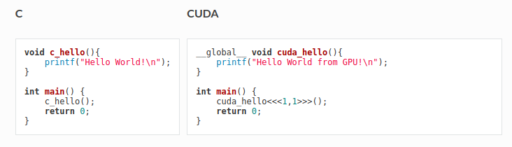

# CUDA_Programming
Some of the basics of CUDA programming and related concepts.

### Requirements:
1. GPU enabled CPU to learn.  
2. CUDA version >= 5.5, but > 9 is preferred.  
3. Google Colabs can be used with some installations.  

### Difference between CUDA and C Programming

### References:    

1. https://www.tutorialspoint.com/cuda/index.htm    
2. https://www.nvidia.com/docs/IO/116711/sc11-cuda-c-basics.pdf    
